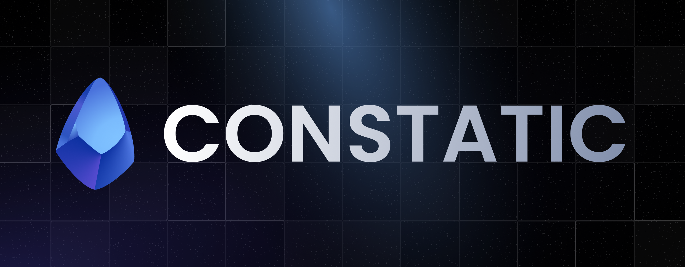

Tools for developing modern Discord bot applications.

---

## 🍴 About this project (Fork)

**Lithium** is a fork of the original project [Constatic](https://github.com/rinckodev/constatic) developed by [@rinckodev](https://github.com/rinckodev). 

While keeping the excellent core ideas and structure of the original project, Lithium was created to introduce customized modifications, adjustments, and improvements tailored specifically for our ecosystem's needs. All credits for the brilliant base architecture go to the original author.

---

## Packages

- `@lithium` ([source](./packages/base)) - Base with structures and functions for creating modern Discord applications.

---

## Links

- [Original Project (Constatic)](https://github.com/rinckodev/constatic)
- [Supporter server (Constatic)](http://discord.gg/tTu8dGN)